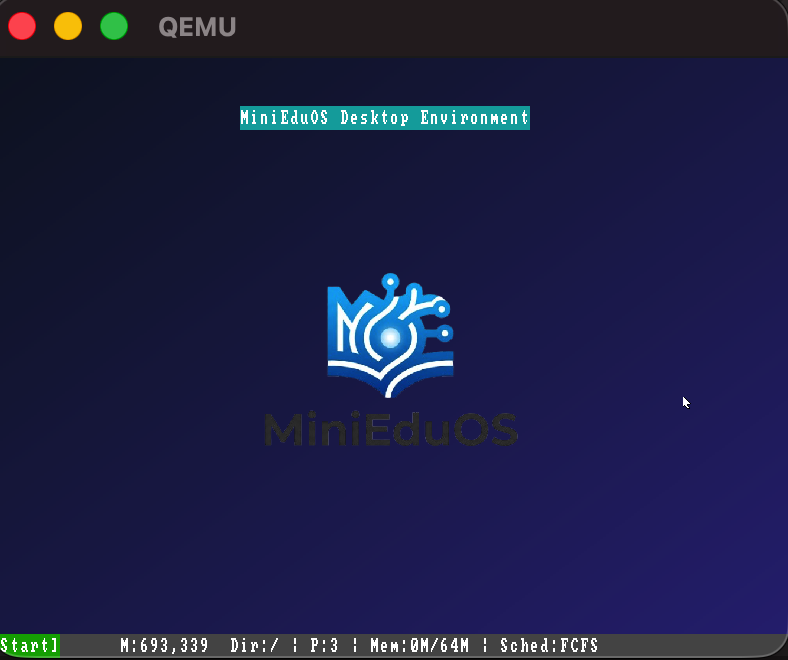
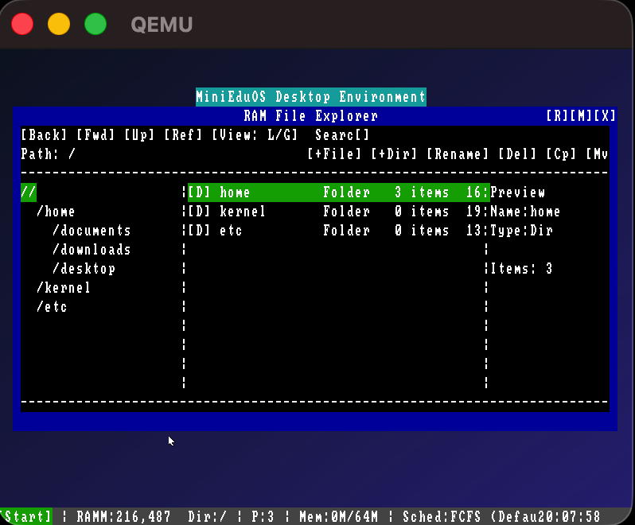
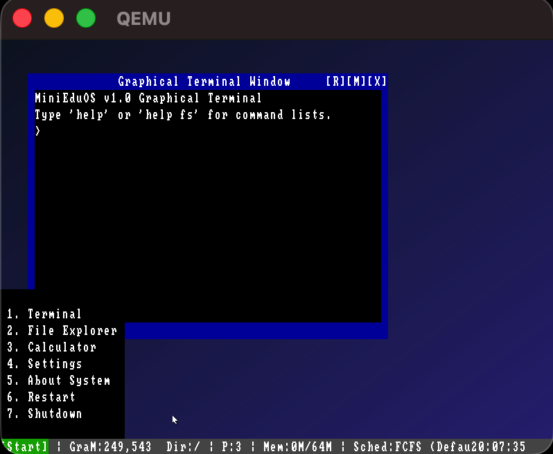
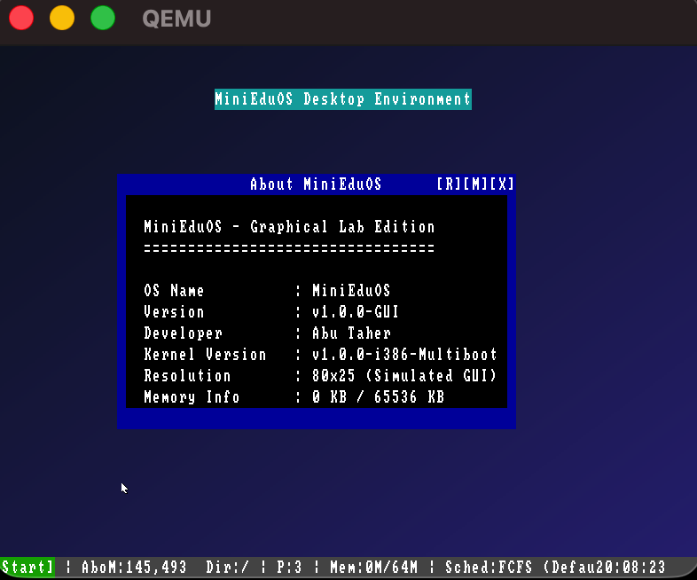

# MiniEduOS

A lightweight educational operating system built from scratch to demonstrate the fundamental concepts of modern operating systems. MiniEduOS is designed for learning, experimentation, and academic purposes, featuring a custom kernel, memory management, process management, CPU scheduling, an in-memory file system, and a graphical desktop environment.

> **Note**
> This project is an educational operating system and is **not intended to replace a production operating system**. It focuses on demonstrating how core OS components work together in a simplified environment.

---

# Screenshots

| Desktop       | File Explorer |
| ------------- | ------------- |
|  |  | 

| Terminal      | System Monitor |
| ------------- | -------------- |
|  |   |

---

# Features

## Boot Process

* Custom boot sequence
* Kernel loading
* Educational boot flow
* QEMU compatible

---

## Kernel

* Freestanding kernel
* Modular architecture
* VGA graphical output
* Command interpreter
* Educational kernel design

---

## Memory Manager

MiniEduOS contains a simulated memory management system that demonstrates how an operating system allocates and manages memory.

Features include:

* Dynamic memory allocation
* Memory deallocation
* Memory usage statistics
* Memory map visualization
* RAM allocation simulation

Supported Commands

```bash
mem
meminfo
malloc <size>
free
memmap
```

---

## Process Manager

The operating system includes a process management subsystem capable of creating and managing simulated processes.

Each process maintains:

* Process ID (PID)
* Name
* Priority
* State
* CPU Time

Supported process states:

* READY
* RUNNING
* WAITING
* TERMINATED

Supported Commands

```bash
ps
new <name>
run <pid>
kill <pid>
top
procinfo
```

---

# CPU Scheduling

MiniEduOS demonstrates several classical CPU scheduling algorithms.

Implemented Algorithms

* First Come First Serve (FCFS)
* Shortest Job First (SJF)
* Priority Scheduling
* Round Robin (RR)

The scheduler also provides:

* Gantt Chart visualization
* Waiting Time calculation
* Turnaround Time calculation
* Average Waiting Time
* Average Turnaround Time

Supported Commands

```bash
schedule

fcfs

sjf

priority

rr <quantum>

gantt

gantt fcfs

gantt sjf

gantt priority

gantt rr
```

---

# Virtual File System

MiniEduOS implements a virtual in-memory file system.

No real disk operations are performed.

Everything exists entirely inside RAM.

Features

* Directory hierarchy
* Nested folders
* File creation
* File deletion
* File reading
* File writing
* File navigation
* Directory tree visualization

Supported Commands

```bash
ls

mkdir <folder>

touch <file>

cat <file>

write <file>

rm <file>

pwd

tree

cd <path>

open <file>
```

---

# Graphical Desktop Environment

MiniEduOS provides a lightweight desktop interface.

Desktop Features

* Wallpaper
* Centered logo
* Mouse cursor
* Window manager
* Desktop applications
* Multiple windows
* Context menus
* Desktop refresh
* Basic GUI interaction

---

# File Explorer

The graphical file explorer integrates directly with the in-memory file system.

Features

* Folder navigation
* File browsing
* Context menus
* File properties
* File operations
* Text file integration
* Folder hierarchy

---

# Built-in Text Editor

The operating system includes a lightweight text editor.

Capabilities

* Create documents
* Open files
* Edit text
* Save
* Save As
* Append
* Multi-line editing

---

# System Settings

MiniEduOS includes a graphical settings application.

Available options include:

* Appearance
* Desktop settings
* Terminal settings
* Display information
* About page

---

# System Monitor

The System Monitor provides an overview of the operating system.

Information displayed includes:

* Kernel version
* Architecture
* CPU usage (simulated)
* Memory usage
* Running processes
* Scheduler
* Uptime
* System information

Supported Commands

```bash
sysinfo

uptime

meminfo

procinfo
```

---

# Terminal

MiniEduOS includes an integrated terminal that communicates directly with the kernel.

The terminal supports:

* Command execution
* File system commands
* Memory management commands
* Process management commands
* Scheduler commands
* System monitoring commands

---

# Desktop Context Menu

Right-clicking on the desktop provides quick access to common actions.

Available options

* Refresh
* New Folder
* New File
* Terminal
* Settings
* About

---

# Project Structure

```text
.
├── boot/
├── kernel/
├── assets/
├── iso/
├── Makefile
├── linker.ld
└── README.md
```

---

# Technologies Used

* C
* x86_64 Assembly
* NASM
* GCC Cross Compiler
* GRUB
* QEMU
* Make

---

# Build Requirements

* QEMU
* NASM
* x86_64-elf GCC Toolchain
* GRUB
* xorriso
* GNU Make

---

# Build

```bash
make
```

---

# Run

```bash
make run
```

---

# Clean

```bash
make clean
```

---

# Educational Objectives

MiniEduOS was developed to demonstrate the implementation of core operating system concepts, including:

* Boot process
* Kernel initialization
* Memory management
* Process management
* CPU scheduling
* File systems
* Desktop environment
* GUI architecture
* System monitoring
* Operating system modularity

---

# Limitations

MiniEduOS is an educational operating system.

The following components are intentionally simplified:

* Virtual memory
* Hardware drivers
* Networking
* Multi-user support
* Persistent storage
* Security model
* Filesystem persistence
* Real hardware scheduling

---

# Future Improvements

Potential future enhancements include:

* Networking stack
* Persistent filesystem
* USB support
* Audio subsystem
* Advanced graphics
* ELF executable loader
* Virtual memory
* User authentication
* Package manager
* Shell scripting
* Multitasking improvements

---

# License

This project is released under the MIT License.

---

# Author

**Abu Taher**

Computer Science and Engineering (CSE)

Patuakhali Science and Technology University

GitHub: https://github.com/AbuTaher003

---

# Acknowledgements

This project was developed as an educational operating system to explore the internal architecture of modern operating systems and gain practical experience with low-level systems programming.
